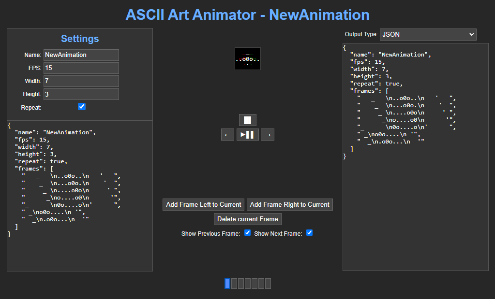

# ASCII Art Animator

ASCII Art Animator is a simple web application that allows you to create and animate ASCII art.
It overlays the current frame with the previous and next frames to give you a better idea of the animation.
It starts with a default animation that you can modify and save as JSON.
The animation is not saved automatically, so you have to copy the content of the text area to save it.
By changing the content of the text area, you can load an animation from JSON.

This application is written in HTML, CSS, and JavaScript and is stored in a single HTML file so you can use it offline.

You can use it online at [ASCII Art Animator](https://derdere.github.io/ascii-art-animator/)

## Features

- Add frames to the animation
- Play/Pause the animation
- Stop the animation
- Delete a frame
- Go to the next frame
- Go to the previous frame
- Change the FPS
- Change the width and height of the frames
- Repeat the animation
- Displays the animation as json
- Load an animation from json
- Export the animation as json, html, c++, or c# code
- Change the theme
- Shortcuts for play/pause, stop, next frame, previous frame, delete frame, add frame left, and add frame right
- Show/hide the previous and next frame in the preview
- Store the animation in the local storage
- Store the theme in the local storage

## License

GNU General Public License v3.0
[View License](LICENSE)

## Author

derDere
[View GitHub Profile](https://github.com/derdere)

## View on GitHub

[View on GitHub](https://github.com/derdere/ascii-art-animator/)
